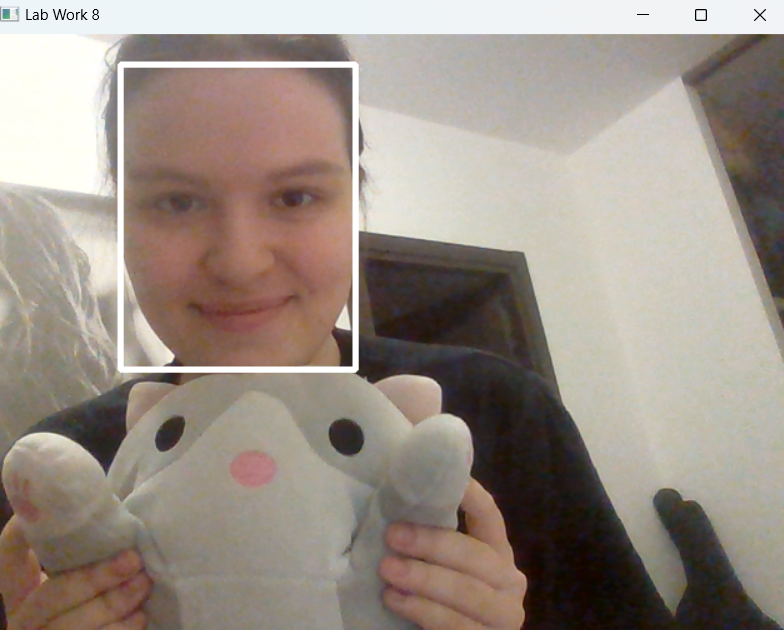

# OpenCV Face Detection

Учебный проект на Python для обнаружения лиц на изображении и видеопотоке с использованием OpenCV.

## Цель

На практике изучить основы компьютерного зрения и работу OpenCV с изображениями и видеопотоком.

## Логика проекта

1. Подключение библиотеки `cv2`.
2. Получение изображения с камеры и вывод его в отдельном окне.
3. Обнаружение лиц с помощью готовой модели OpenCV.
4. Выделение обнаруженных лиц на изображении.
5. Обработка видеопотока с камеры в режиме реального времени.
6. Обработка изображения, переданного программе на вход.

## Результат работы

### Обнаружение лица с камеры



### Обнаружение лица на изображении

.png)

## Что реализовано

* получение изображения с веб-камеры;
* обнаружение лиц на изображении;
* выделение найденных лиц рамками;
* обработка изображения из файла;
* обнаружение лиц в режиме реального времени;
* использование готовой модели OpenCV DNN.

## Структура проекта

```text
OpenCV-Face-Detection/
├── images/
│   ├── СФ1.png
│   └── Рис 1(1).png
├── image.jpg
├── main.py
├── opencv_face_detector.pbtxt
├── opencv_face_detector_uint8.pb
├── README.md
└── requirements.txt
```

## Технологии

* Python
* OpenCV
* OpenCV DNN
* Computer Vision
* обработка изображений
* обработка видеопотока

## Результат

В рамках проекта реализовано обнаружение лиц на изображениях и видеопотоке с использованием OpenCV и готовой модели компьютерного зрения.
